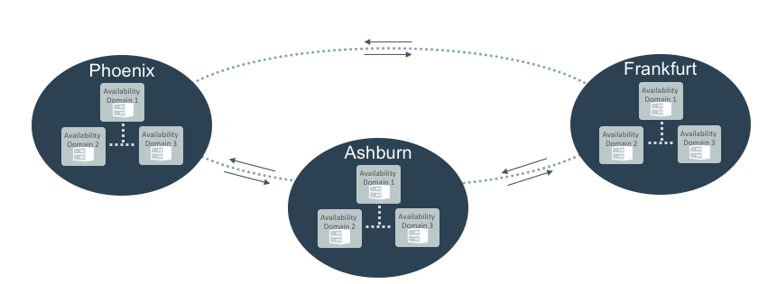

Foundational Training

Getting Started with Oracle Cloud Infrastructure

---

 #### Regions + Avaiability Domains + Backbone Network 

- @size[0.6em](Regions serve different geographies – provide Disaster Recovery capability)
- @size[0.6em](Availability Domains – provide a High Availability foundation within a region)
- @size[0.6em](Backbone Network + Peering – private connectivity between regions and direct peering)

